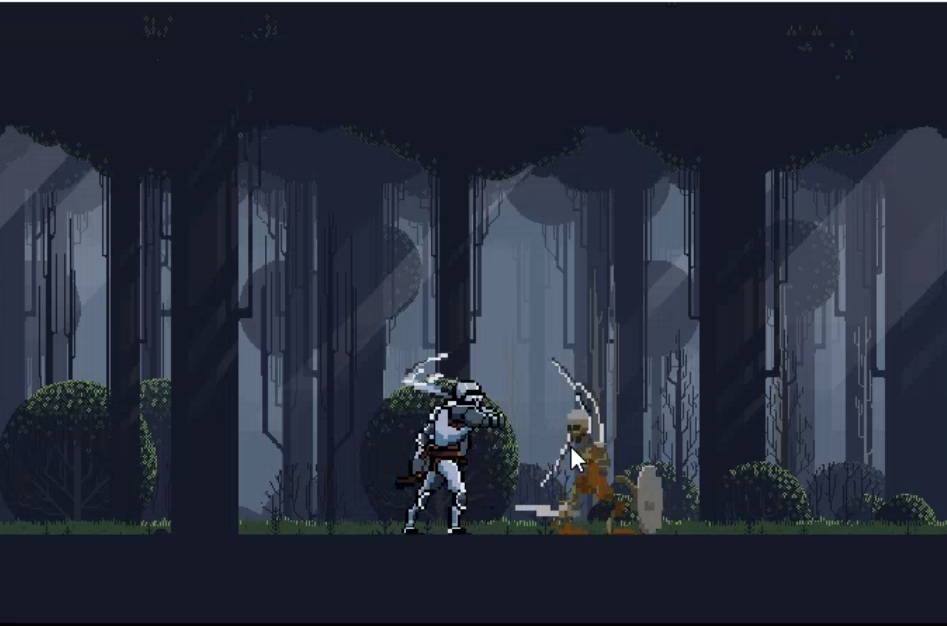
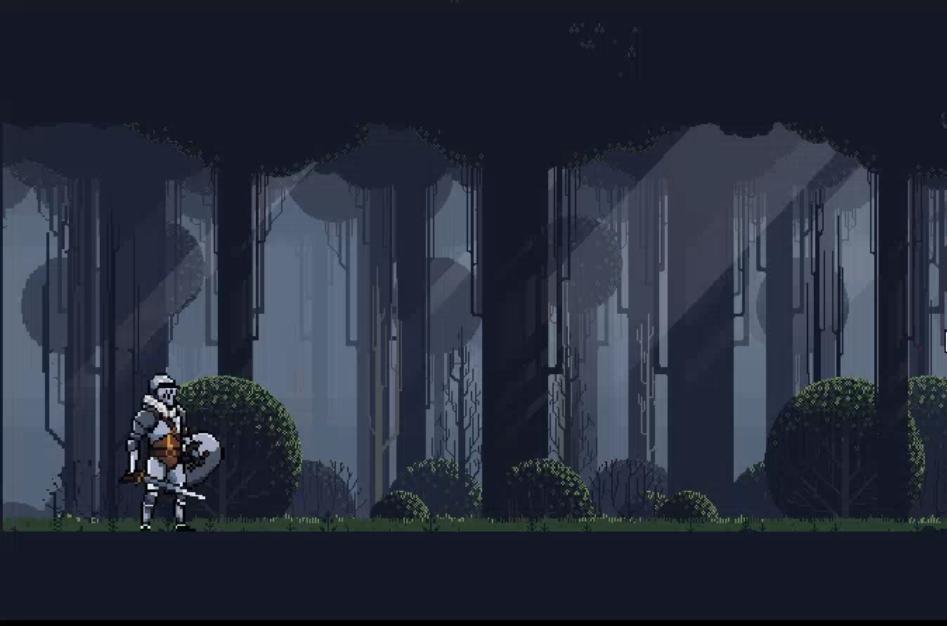

# Gameland - Tower Of Heroes

<h1 align="center">   </h1>
<h1 align="center">   </h1>

Projeto feito em GML linguagem da engine Gamemaker 2 
Project made in the GML language of the Gamemaker 2 engine

### Link do Game [Tower Of Heroes](https://github.com/Samuel-Sena/Tower-Of-Heroes)

 <h3> Ferramentas Utilizadas 🛠 </h3>
 <ul>
  <li> [Gamemaker 2] (https://gamemaker.io/pt-BR) </li>	
  <li> [GML] (https://gamemaker.io/pt-BR) </li>
 </ul>

## Running
Tenha o Gamemaker 2 instalado  
baixe o repositório
~~~
https://github.com/Samuel-Sena/Tower-Of-Heroes
~~~
importe para o Gamemaker 2 o arquivo .yyp 

### Dessa forma você estará conectado ao Game !
